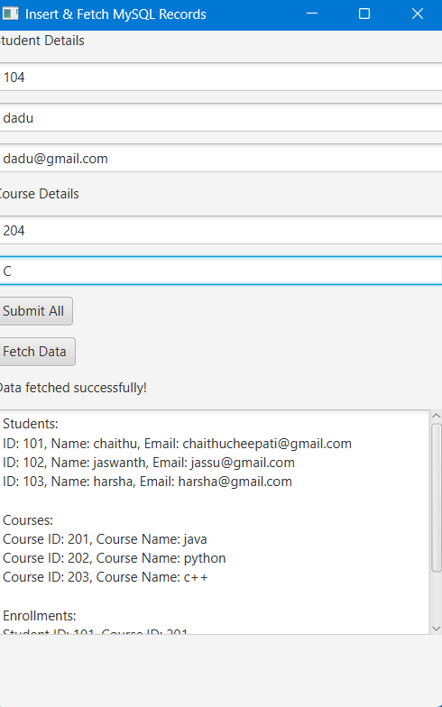

# 🎓 Student Management System - JavaFX + MySQL 🚀


> 📘 **A complete desktop-based Student Management System built with JavaFX and MySQL.**  
> 🔄 Handles real-time insertions and displays for students, courses, and enrollments.  
> 🎯 Designed for simplicity, performance, and academic use-cases.

---

## ✨ Features That Shine

🌟 **Insert Data** – Add students and courses with a single click  
📚 **Many-to-Many Mapping** – Automatically enroll students into selected courses  
🔍 **Real-time Data Fetch** – Instantly display all stored records  
🛡 **Validation & Error Handling** – Catch duplicate IDs, empty fields, and invalid input gracefully  
🖼 **Simple UI** – Clean and intuitive JavaFX interface  
⚡ **Fully Functional** – Backed by JDBC and MySQL relational integrity

---

## 📸 Application UI Preview

Here’s a live screenshot of the system in action:



> 📌 The app displays data fetched from the MySQL database after inserting records from the JavaFX interface.

---

## 🧱 Database Schema Setup

Before running the app, create the required database schema:

```sql
CREATE DATABASE stdinfo;
USE stdinfo;

CREATE TABLE students (
  student_id INT PRIMARY KEY,
  name VARCHAR(100),
  email VARCHAR(100)
);

CREATE TABLE courses (
  course_id INT PRIMARY KEY,
  name VARCHAR(100)
);

CREATE TABLE enrollments (
  student_id INT,
  course_id INT,
  FOREIGN KEY (student_id) REFERENCES students(student_id),
  FOREIGN KEY (course_id) REFERENCES courses(course_id)
);
```

---

## 💻 How to Run

### 🚦 Prerequisites
- Java 11 or above
- JavaFX SDK (configured with VM options)
- MySQL Server 8.x
- MySQL Connector/J (JDBC driver)

### ⚙️ Setup & Execution

1. **Clone this repo** or copy the files.
2. **Create the database** using the SQL schema above.
3. **Update database credentials** in `FXDatabaseInsert.java`:
   ```java
   DriverManager.getConnection("jdbc:mysql://localhost:3306/stdinfo", "root", "YourPasswordHere");
   ```
4. **Add required libraries** to your project:
   - JavaFX SDK JARs
   - MySQL Connector/J JAR
5. **Run the application** as a JavaFX app from your IDE or terminal.

### 🛠 VM Arguments for JavaFX (Eclipse/IntelliJ)
```
--module-path /path/to/javafx-sdk/lib --add-modules javafx.controls,javafx.fxml
```

---

## 🧩 Technologies Used

| Technology | Description                     |
|------------|---------------------------------|
| Java       | Backend and application logic   |
| JavaFX     | GUI framework                   |
| JDBC       | Database connectivity           |
| MySQL      | Relational data storage         |

---

## 🤯 Code Highlights

- Insert operations into **three related tables** (`students`, `courses`, `enrollments`)
- SQL constraints and exception handling
- Fetches and formats database output into a readable format
- Clear UI with labels, text fields, and interactive buttons

---

## 🔮 Future Enhancements

- 🔄 Edit/Delete operations for records  
- 🔍 Search/filter capability  
- 📤 Export data to Excel or PDF  
- 🧑‍💼 Add login authentication for admins  
- 📲 Build mobile-ready version using Gluon

---

## 👨‍💻 Author

Made with ❤️ by **Chaithravardhan Reddy Chepati**

📬 Email: [chaithuchepati@gmail.com](mailto:chepatichaithravardhanreddy@gmail.com)

---

## ⭐ If You Like This Project

Give it a ⭐ on GitHub, share with your classmates, and feel free to fork and improve!  
Every great application starts with a well-structured project like this. ✨
